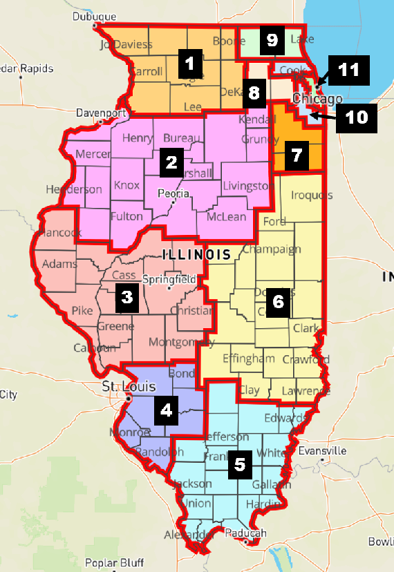

# Data for Illinois SARS-CoV-2 model

## Demography
We divided the state into 11 regions that are part of the [Restore Illinois plan](https://dph.illinois.gov/restore).
`covid_region_populations.csv` contains the July 2018 Census population estimates in 10-year age bins for these regions.

## Underreporting

To account for underreported deaths, we used the excess deaths estimated for the state of Illinois as calculated by the [CDC](https://www.cdc.gov/nchs/nvss/vsrr/covid19/excess_deaths.htm). 
We estimated the reporting probability of a COVID death by comparing excess deaths to the observed number of COVID deaths in a given week. 
