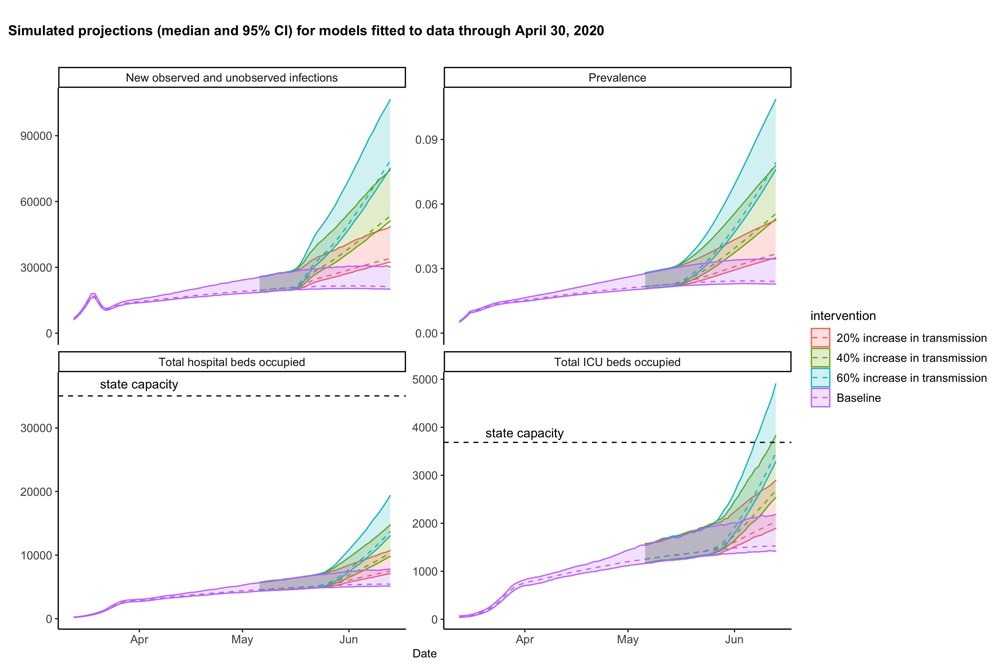
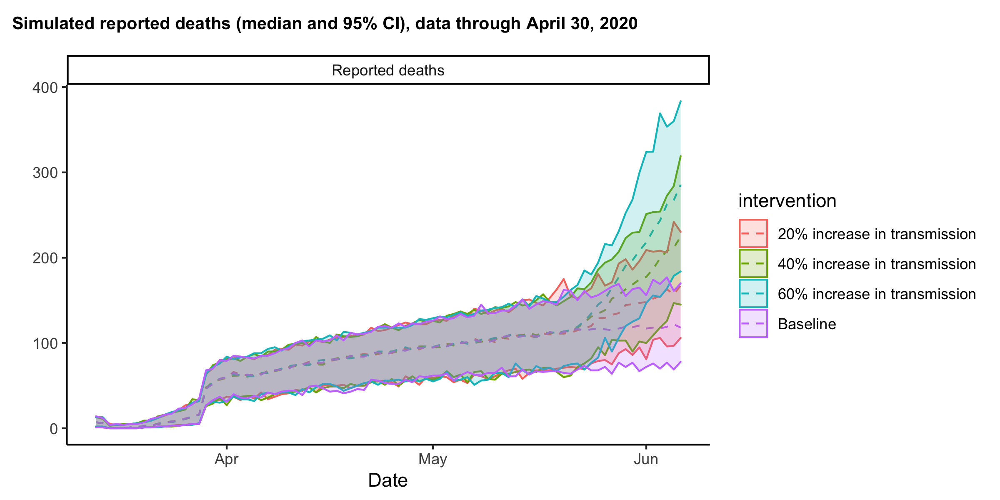
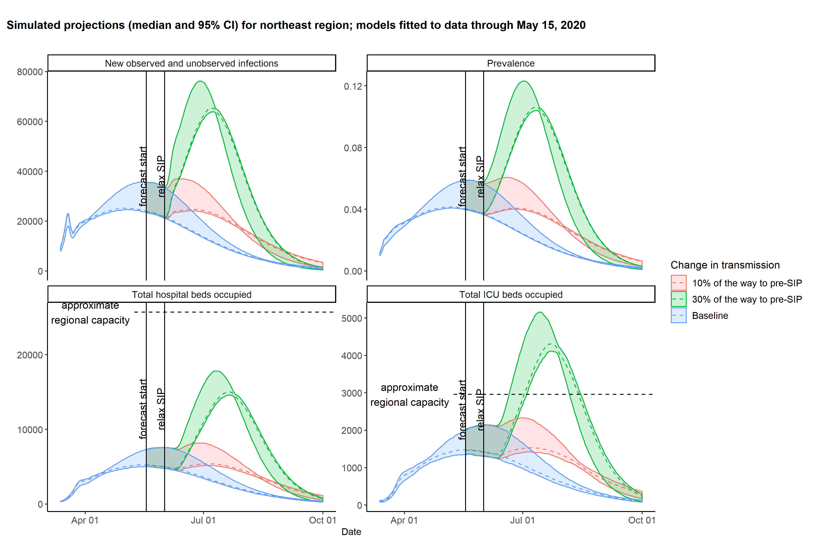
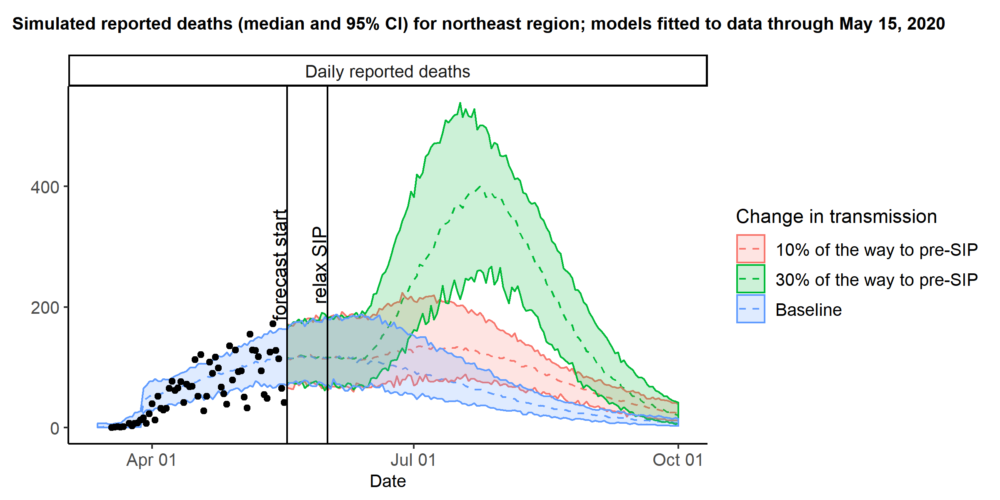
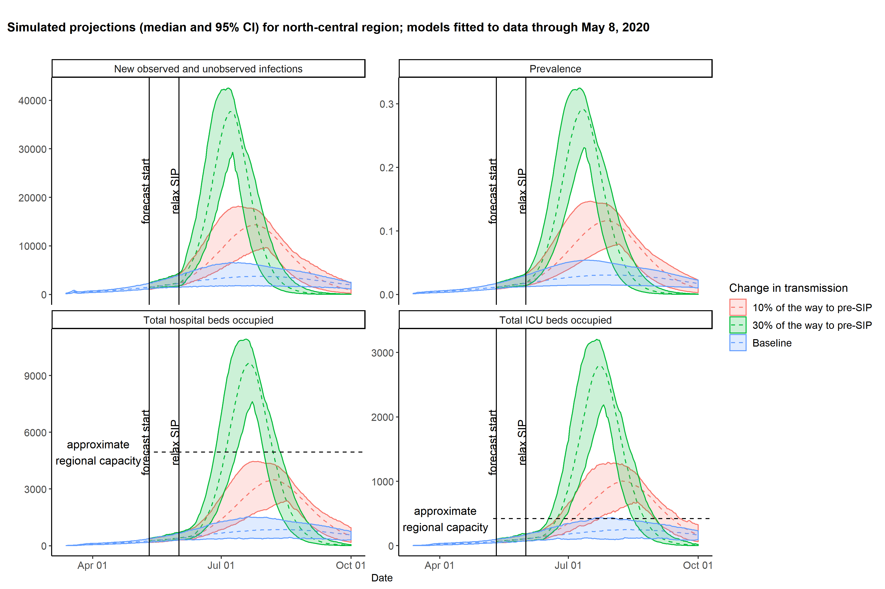
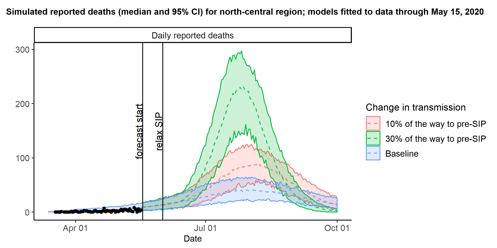
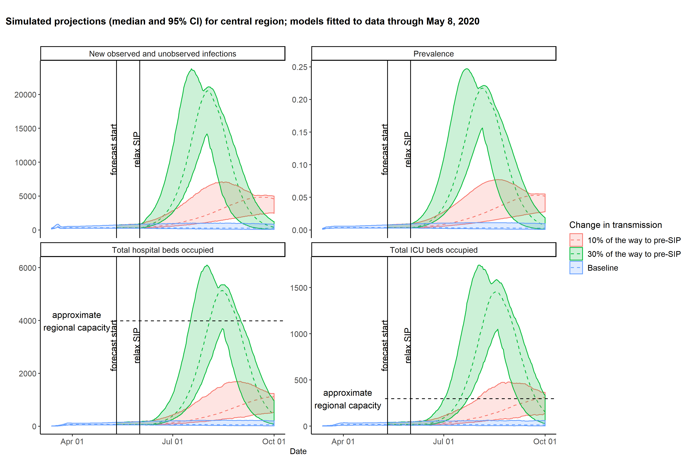
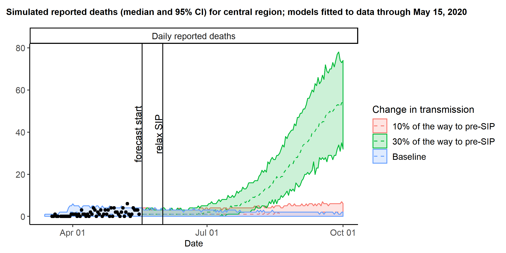
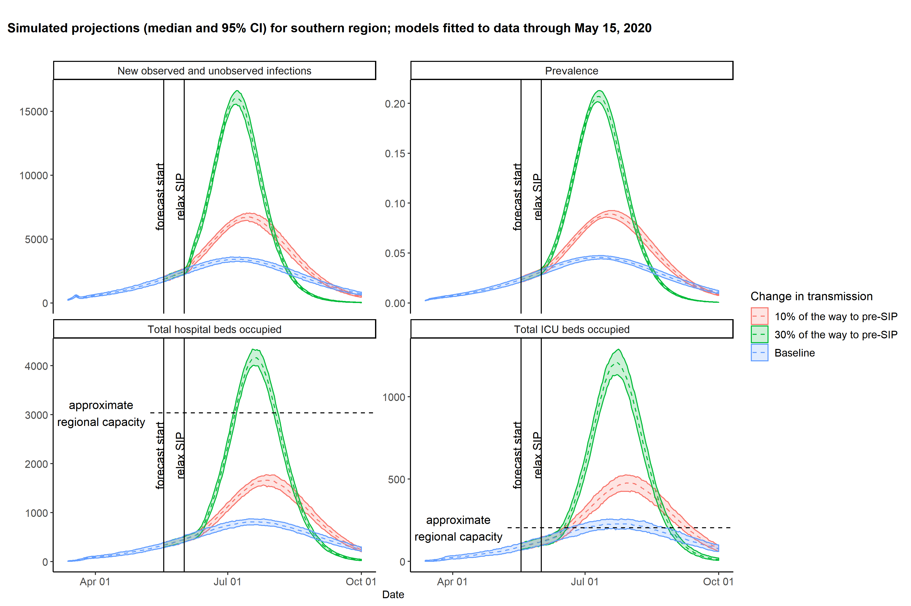
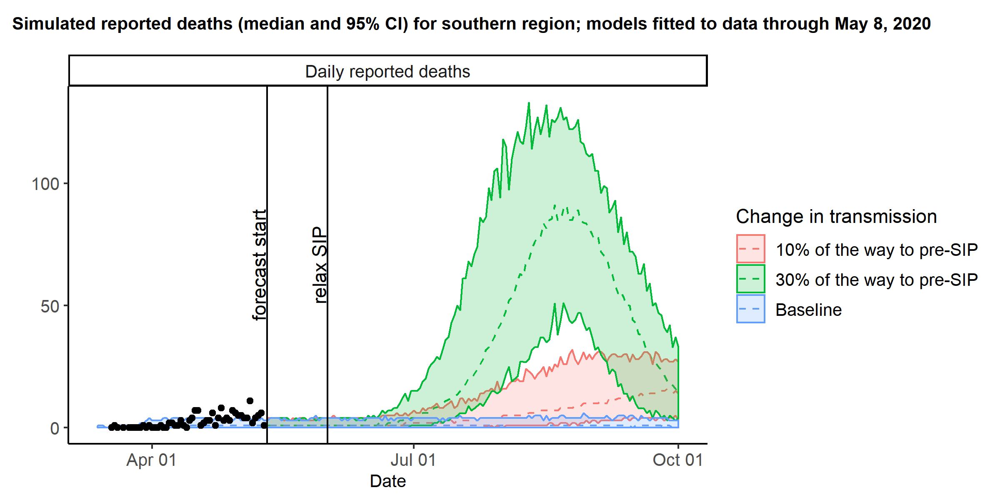

# Forecasting for Illinois SARS-CoV-2 model

## Evaluating the effects of shelter-in-place (SIP)
We implement SIP both by scaling contact rates and by scaling the transmission rate directly.
We assume that a SIP order scales down non-home contacts (work contacts, school contacts, and other contacts). 
On March 16, we scaled down school contacts to 0, work contacts to 0.6 times their normal value, and other contacts to 0.5 times their normal value. 
We then inferred a separate post-SIP transmission rate.
For the baseline model scenario, we maintain the inferred value of the post-SIP transmission rate indefinitely. We assume that this is the maximum reduction in transmission. At our current parameter estimates, this corresponds to a 79% reduction in pre-SIP transmission rate. To model the relaxing of SIP, we project two additional scenarios, assuming that an increase in transmission happens on June 1, 2020:

1. The post-SIP transmission rate increases 10% of the way back to pre-SIP transmission.
2. The post-SIP transmission rate increases 30% of the way back to pre-SIP transmission.

Figure 1 gives the projected statewide incident infections, population prevalence, non-ICU hospital occupancy, and ICU occupancy through October 1, 2020 under the four model scenarios. 

Figure 2 gives the projected statewide daily reported hosptialized and non-hospitalized deaths through October 1, 2020, and reported daily deaths from the Illinois Department of Public Health (IDPH) under the four model scenarios. 

 

## Region-specific forecasts: northeast

Figure 3 gives the projected incident infections, population prevalence, non-ICU hospital occupancy, and ICU occupancy through October 1, 2020 in the northeast region under the four model scenarios. 

Figure 4 gives the projected daily reported hosptialized and non-hospitalized deaths through October 1, 2020 in the northeast region under the four model scenarios. Regional death data from IDPH are shown as points.

 

## Region-specific forecasts: north-central

Figure 5 gives the projected incident infections, population prevalence, non-ICU hospital occupancy, and ICU occupancy through October 1, 2020 in the north-central region under the four model scenarios. 

Figure 6 gives the projected daily reported hosptialized and non-hospitalized deaths through October 1, 2020 in the north-central region under the four model scenarios. Regional death data from IDPH are shown as points.

 

## Region-specific forecasts: central

Figure 7 gives the projected incident infections, population prevalence, non-ICU hospital occupancy, and ICU occupancy through October 1, 2020 in the central region under the four model scenarios. 

Figure 8 gives the projected daily reported hosptialized and non-hospitalized deaths through October 1, 2020 in the central region under the four model scenarios. Regional death data from IDPH are shown as points.

 

## Region-specific forecasts: southern

Figure 9 gives the projected incident infections, population prevalence, non-ICU hospital occupancy, and ICU occupancy through October 1, 2020 in the southern region under the four model scenarios. 

Figure 10 gives the projected daily reported hosptialized and non-hospitalized deaths through October 1, 2020 in the southern region under the four model scenarios. Regional death data from IDPH are shown as points.

 

## File descriptions

* `simulate_projections.Rmd`: R-markdown file to simulate and plot forecasts for the state of IL based on the inference results.
* `input_file_specification.R`: R script to read in files for simulation. Called within `simulate_projections.Rmd`
* `inference_to_simulation.R`: R script to run and store simulation output. Called within `simulate_projections.Rmd`
* `simulation_statewide.R`: R script with functions for simulation. Called within `inference_to_simulation.R`
* `plot_intervention_comparisons.R`: R script to plot simulation output. Called within `simulate_projections.Rmd`

## Changelog
### 2020-05-11
* Fitted with data through May 8, 2020. 
* Changed date of transmission increase from May 15 to May 29.
* Added non-hospitalized deaths to process model instead of calculating post-hoc. 
* Switched from statewide to region-specific, symmetric contact matrices.

