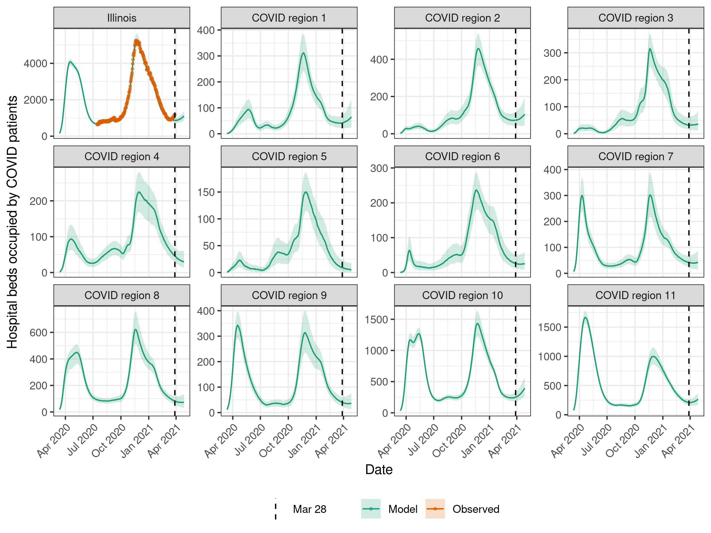
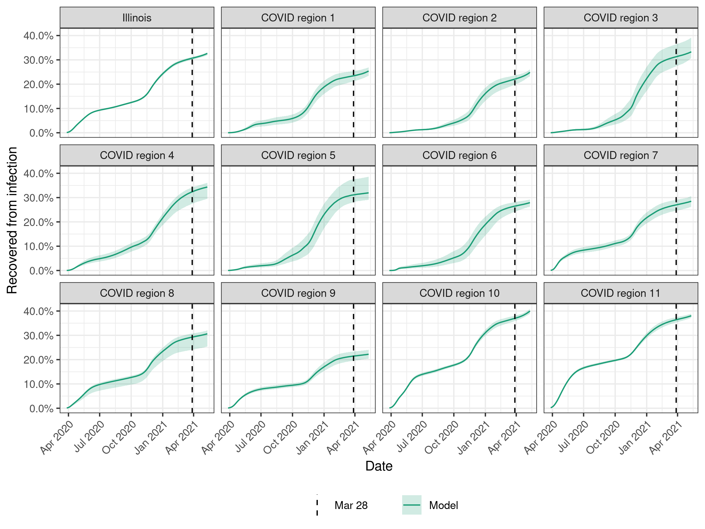

# Forecasting for Illinois SARS-CoV-2 model

## Projecting infections, deaths, and hospitalizations

Our model is calibrated to each of the 11 COVID regions defined by the [Restore Illinois plan](https://coronavirus.illinois.gov/s/restore-illinois-introduction) (see [Data](../Data)). 
Statewide estimates are produced by aggregating the projections from all regions.

We simulate our model forward in time to obtain projections for deaths, hospitalizations, and infections.
To account for the uncertainty in our estimate of the final transmission rate, we first evaluated the likelihood of rates within 10% of the maximum-likelihood value.
We then produced 1000 simulations using final transmission rates sampled proportionally to likelihood, so that values more consistent with the data were more likely to be sampled.

Below, we show the results of our model projections through December 31, 2020.
Solid lines indicate the median projected value and the shaded area shows the 95% prediction interval. 
The dashed line shows the latest date in the data used to calibrate the model.

Figure 1: Deaths per day in the state of Illinois and each of the 11 COVID regions. Data (orange) are plotted by reporting date and model results (green) are plotted by precise date of death.

Figure 2: Hospital beds occupied by COVID-19 patients in the state of Illinois and each of the 11 COVID regions. Orange points show the number of hospital beds occpied by COVID patients for the state of Illinois [reported to the CDC](https://healthdata.gov/dataset/covid-19-reported-patient-impact-and-hospital-capacity-state-timeseries).

Figure 3: Estimated fraction of the population that is currently infectious in the state of Illinois and each of the 11 COVID regions. 

Figure 4: Estimated fraction of the population that has recovered in the state of Illinois and each of the 11 COVID regions.

## Changelog
### 2020-11-25
* Removed age structure from model.
* Fitted separately to 11 COVID regions.
* Hospitalization model simplified: no longer modeling ICU stay.
* Inferred parameters: 13 transmission changepoints, initial prevalence, HFR, duration of hospital stay, probability of death for non-hospitalized infections.
* Used CDC all-cause mortality data to estimate underreporting of deaths.

### 2020-05-18
* Fitted to 4 regions instead of 3.
* Added datastream to fit: non-hospitalized deaths through 2020-04-26.
* Incorporated uncertainty in the fraction of total deaths that are non-hospitalized. 

### 2020-05-15
* Added regional projections.
* Changed post-SIP scenarios. Transmission now increases 10% or 30% of the way back to pre-intervention transmission.
* Changed date of post-SIP transmission rise from May 29, 2020 to June 1, 2020.
* Plot projections until October 1, 2020.

### 2020-05-11
* Fitted with data through May 8, 2020. 
* Changed date of transmission increase from May 15 to May 29.
* Added non-hospitalized deaths to process model instead of calculating post-hoc. 
* Switched from statewide to region-specific, symmetric contact matrices.

