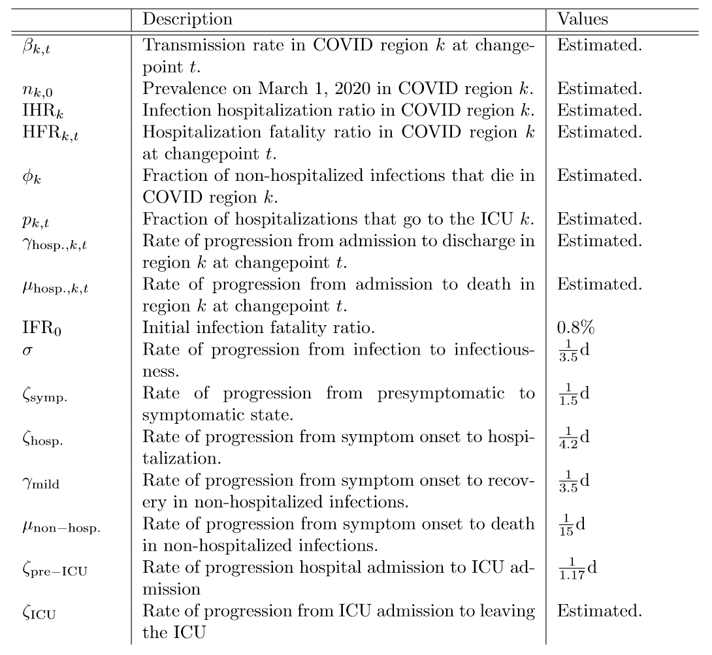

# Parameter values

## Table 1: Parameters and descriptions

## Table 2: Age-specific parameter values

# Sources

## Parameters derived from the serial interval and incubation period: &zeta;symp. and &sigma;

Best estimates place the mean incubation period of the virus at 6 days1,2,3,4 and the mean serial interval at 4.25 days3,5,6. Assuming that cases become infectious 0.5-1 days prior to transmission, we can use these estimates to calculate the time between infection and infectiousness (&sigma;-1) and the time from infectiousness to symptom onset (&zeta;symp.-1).

## Rate of recovery for mildly symptomatic infections: &gamma;m

Based on viral isolation data from patients with mild disease, we estiamte that infectiousness of mildly symptomatic people wanes after 7.5 days7.

## Rate of recovery for asymptomatic infections: &eta;

We assumed that the duration of infectiousness is similar in mild and asymptomatic cases and therefore estimate that the total time to recovery for asymptomatic people is 10 days.

## Fraction of infections that are asymptomatic and fraction of presymptomatic infections that become severe: &rho;i and &kappa;i

We combined information on the fraction of asymptomatic infections among passengers on the Diamond Princess8 with age-specific information on case fatality rates9 and infection fatality rates9 to calculate the age-specific fraction of asymptomatic infections. We then used these estimates along with age-specific infection fatality rates9 to estimate the age-specific fraction of presymptomatic infections that are severe. 

## Test sensitivity and fraction of hospitalized infections that are tested: &theta;test and &nu;hosp.

Data on PCR test-sensitivity ranges from 60%-90% and likely depends on viral load 10,11. Since we are interested in test results from hospitalized patients who are at risk of death, we assume that test-sensitivity for this population is on the higher end of this range (85%). We do not have data to directly inform the probability of receiving a test given that a person is hospitalized. However, given our current understanding of testing protocol in hospitals, it is reasonable to assume that most people who are hospitalized with covid-like symptoms will be tested, so we fix this probability at 95%.

## Parameters affecting hospitalization

Parameters that determine how hospitalized people are partitioned (&psi;1,2,3,4) and the rates at which they move through the hospital to death or recovery (&zeta;crit., &gamma;hosp., &mu;crit., &mu;hosp.)were based on current data from a hospital system in Illinois. 

# References

1.  Backer Jantien A, Klinkenberg Don, Wallinga Jacco. Incubation period of 2019 novel coronavirus (2019-nCoV) infections among travellers from Wuhan, China, 20–28 January 2020. Euro Surveill. 2020;25(5):pii=2000062. https://doi.org/10.2807/1560-7917.ES.2020.25.5.2000062
2. Lauer SA, Grantz KH, Bi Q, et al. The Incubation Period of Coronavirus Disease 2019 (COVID-19) From Publicly Reported Confirmed Cases: Estimation and Application. Ann Intern Med. 2020; [Epub ahead of print 10 March 2020]. doi: https://doi.org/10.7326/M20-0504
3. Lauren Tindale, Michelle Coombe, Jessica E Stockdale, Emma Garlock, Wing Yin Venus Lau, Manu Saraswat, Yen-Hsiang Brian Lee, Louxin Zhang, Dongxuan Chen, Jacco Wallinga, Caroline Colijn
medRxiv 2020.03.03.20029983; doi: https://doi.org/10.1101/2020.03.03.20029983 
4. Linton, N.M.; Kobayashi, T.; Yang, Y.; Hayashi, K.; Akhmetzhanov, A.R.; Jung, S.-M.; Yuan, B.; Kinoshita, R.; Nishiura, H. Incubation Period and Other Epidemiological Characteristics of 2019 Novel Coronavirus Infections with Right Truncation: A Statistical Analysis of Publicly Available Case Data. J. Clin. Med. 2020, 9, 538. 
5. Du Z, Xu X, Wu Y, Wang L, Cowling BJ, Ancel Meyers L. Serial interval of COVID-19 among publicly reported confirmed cases. Emerg Infect Dis. 2020 Jun. https://doi.org/10.3201/eid2606.200357
6. Nishiura H, Linton NM, Akhmetzhanov AR. Serial interval of novel coronavirus (COVID-19) infections. Int. J. Infect. Dis. 2020. doi: 10.1016/j.ijid.2020.02.060
7. Wölfel, R., Corman, V.M., Guggemos, W. et al. Virological assessment of hospitalized patients with COVID-2019. Nature (2020). https://doi.org/10.1038/s41586-020-2196-x
8. Mizumoto Kenji, Kagaya Katsushi, Zarebski Alexander, Chowell Gerardo. Estimating the asymptomatic proportion of coronavirus disease 2019 (COVID-19) cases on board the Diamond Princess cruise ship, Yokohama, Japan, 2020. Euro Surveill. 2020;25(10):pii=2000180. https://doi.org/10.2807/1560-7917.ES.2020.25.10.2000180
9. Robert Verity, Lucy C Okell, Ilaria Dorigatti, Peter Winskill, Charles Whittaker, Natsuko Imai, Gina Cuomo-Dannenburg, Hayley Thompson, Patrick G T Walker, Han Fu, Amy Dighe, Jamie T Griffin, Marc Baguelin, Sangeeta Bhatia, Adhiratha Boonyasiri, Anne Cori, Zulma Cucunubá, Rich FitzJohn, Katy Gaythorpe, Will Green, Arran Hamlet, Wes Hinsley, Daniel Laydon, Gemma Nedjati-Gilani, Steven Riley, Sabine van Elsland, Erik Volz, Haowei Wang, Yuanrong Wang, Xiaoyue Xi, Christl A Donnelly, Azra C Ghani, Neil M Ferguson. Estimates of the severity of coronavirus disease 2019: a model-based analysis. The Lancet Infectious Diseases, 2020.
10. Wang W, Xu Y, Gao R, et al. Detection of SARS-CoV-2 in Different Types of Clinical Specimens. JAMA. Published online March 11, 2020. doi:10.1001/jama.2020.3786
11. Yang Yang, Minghui Yang, Chenguang Shen, Fuxiang Wang, Jing Yuan, Jinxiu Li, Mingxia Zhang, Zhaoqin Wang, Li Xing, Jinli Wei, Ling Peng, Gary Wong, Haixia Zheng, Mingfeng Liao, Kai Feng, Jianming Li, Qianting Yang, Juanjuan Zhao, Zheng Zhang, Lei Liu, Yingxia Liu.  Evaluating the accuracy of different respiratory specimens in the laboratory diagnosis and monitoring the viral shedding of 2019-nCoV infections. medRxiv 2020.02.11.20021493; doi: https://doi.org/10.1101/2020.02.11.20021493

