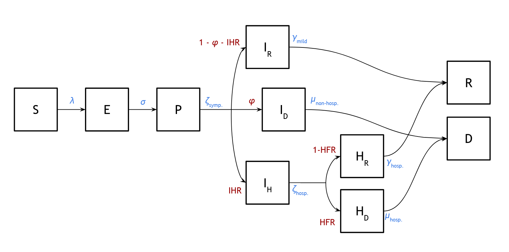

# Forecasting SARS-CoV-2 dynamics for the state of Illinois

*Contributors (alphabetically listed): Phil Arevalo, Ed Baskerville, Spencer Carran, Sarah Cobey, Katelyn Gostic, Lauren McGough, Sylvia Ranjeva, & Frank Wen 
*Correspondence to: [Sarah Cobey](cobey@uchicago.edu)

### Introduction 
In order to better understand the COVID-19 epidemic in Illinois, we have developed a mathematical model representing the process of contact and transmission between people, the progression of disease, and the movement of people through the hospital system.

This kind of model serves several purposes.

First and foremost, the process of designing the model gives us a way to think carefully through what details are likely to be important, both in terms of driving the course of the epidemic and in terms of the relationship between the epidemic itself and different sources of observed data, which may vary widely in resolution, quality, and biases in sampling.
This process draws heavily on other scientists’ work about the epidemic and the disease, on things learned from other diseases, and on mathematical theory.

Second, once we have a model structure in place and have fit it to data, the model fits give us a sense, albeit uncertain, of what has already happened: How many actual infections were behind the number of observed cases and deaths? How fast is the epidemic currently growing? How far is the population from “herd immunity”? (As of this writing, we think quite far.)

Finally, the model lets us do hypothetical experiments with the computer, again contingent on several sources of uncertainty.
If people begin interacting normally again, how much faster will the epidemic grow?
How many more people are likely to die if a shelter-in-place order is ended?
If the order is continued indefinitely, how long will it take before the level of infection becomes undetectable?
And, importantly, if we adjust the assumptions in our model, how does our understanding of the situation change?

There are three main sources of uncertainty in this kind of model: process uncertainty (“stochasticity”), observation uncertainty (“sampling error”), and uncertainty in the model structure itself.
Because the specific, person-to-person details of interaction are essentially unpredictable, there is inherent uncertainty in how the epidemic will progress.
Because observed data is a highly incomplete picture of reality, it places inherent limits on what we can learn about the underlying epidemic process.
And because the assumptions of the model may be wrong in important ways, there is uncertainty in the model structure, which is why it is important to test different models, and why it is important for different groups of people to engage in parallel, independent modeling efforts.

This process is ongoing, and we will continue to review new data and analyses as they become available in order to refine assumptions about the underlying process and the observed data.
We will also continue to try different modeling approaches with different assumptions, to see how different assumptions affect conclusions.
And we will continue to engage in a dialogue with other scientists and modelers, and learn from what they are doing.

### Model overview

We developed a model to infer key aspects of SARS-CoV-2 transmission in Illinois, and to forecast community spread, hospital and ICU burden, and mortality under current and hypothetical public health interventions. 

The model is a so-called “compartmental model,” because it tracks the number of people in different categories, or compartments, as shown in the diagram below.
The model is based on a standard formulation known as an SEIR model, whose basic compartments consist of four groups: individuals that are susceptible to the virus (S); individuals that have been exposed and infected to the virus but are not yet able to infect others (E); individuals that are infectious, i.e., able to infect others (I); and recovered, individuals that are no longer infected and have gained immunity (R).
We further subdivide these compartments in order to track asymptomatic vs. symptomatic infections, stages of hospitalization, and fatalities.
The model is also “age-structured,” meaning that we explicitly represent differences in how people of different ages interact with each other and with the virus.

Specifically, in the model (Figure 1), when individuals are infected, they enter into the exposed class (E), where they cannot transmit infections to others. Individuals that enter the asymptomatic class (A) can infect others in the community but will eventually clear the infection without ever showing symptoms of disease, while those that enter the presymptomatic infectious class (P) will progress to symptomatic disease. Symptomatic infections are divided into mild cases, IM, which will resolve without hospital attention, and severe cases, IS that will require hospitalization. The class IH refers to severe cases that are hospitalized but not in the ICU, and the IC class refers to severe cases in the ICU. We explicitly track deaths from individuals in the hospitalized and ICU classes (IH4 and IC, respectively). We account for deaths that occur outside of the hospital in our simulations via a scaling factor informed by the model parameters and by data on outside-of-hospital deaths from New York City (see [Parameters](./Parameters)).

Rate parameters determine the amount of time the average infected person spends in a given compartment. Probabilities determine what fraction of infected people follow specific transition paths between compartments.
To incorporate demographic stochasticity, the model is implemented in a sub-day discrete-time approximation of a continuous-time stochastic framework.

### Data
We model the state-level dynamics of SARS-CoV-2 via three distinct geographic regions, as described in [Data](./Data). The model is fitted to in-hospital deaths reported by the New York Times from March 15 to March 24, 2020 and to in-hospital deaths reported by the Illinois Department of Publc Health from March 24, 2020 onwards. 

### Inference
For each region in Illinois, we infer the transmission rate of SARS-CoV-2 before and after public health interventions, as well as the number of individuals infected at the beginning of the simulations (on March 1, 2020). We fix all other parameters based on values chosen from the literature, as described in the [Parameters](./Parameters) directory. 
We fitted the model to the data using maximum likelihood methods for partially observed Markov process (POMP) models (details in [Inference](./Inference)).

### Model outputs
We simulate the dynamics of SARS-CoV-2 in Illinois using the best-fit parameters from the model inference.
Our model can forecast the effects of public health interventions of varying forms, strengths, and durations. 
These model forecasts will be provided in the [Forecasting](./Forecasting) directory. 

### Public health interventions 
We incorporate interventions as scaling factors on the transmission rate for all infected individuals, and as reductions in  age- and setting-specific contact rates. Our baseline model scenario reflects the enactment of "shelter in place" interventions in Illinois beginning on March 16, 2020, extended indefinitely ("indefinite"). The shelter in place scenario involves an inferred reduction in transmission rate, a 100% reduction in at-school contacts, a 40% reduction in at-work contacts, and a 50% reduction in all other contacts occurring outside of the home. We also consider two hypothetical scenarios:

1. Lifting shelter in place on May 1, 2020 ("lifted")
2. The absence of shelter in place ("never")
  
### References
1. King AA, Nguyen D and Ionides EL (2015) Statistical inference for partially observed Markov processes via the R package pomp. arXiv preprint arXiv:1509.00503.

-------------------------------------------

Distributed under the xx --- insert CC license---.
