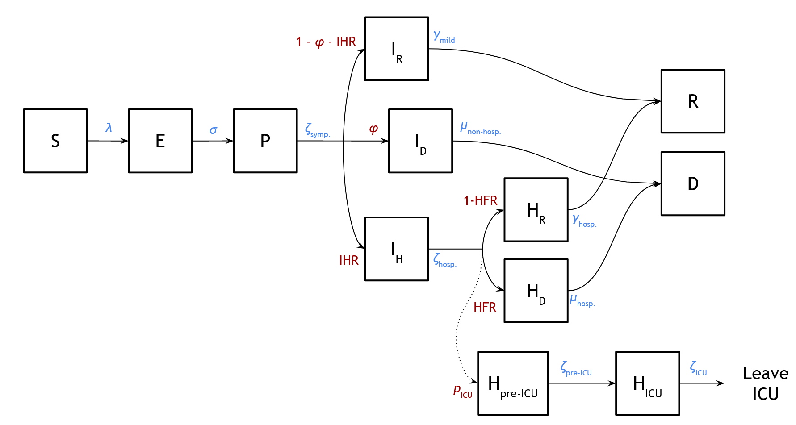

# Inferring and forecasting COVID-19 dynamics for the state of Illinois

*Contributors (alphabetically listed): Phil Arevalo, Ed Baskerville, Spencer Carran, Sarah Cobey, Katelyn Gostic, Lauren McGough, Sylvia Ranjeva, & Frank Wen 

### Introduction 
We developed a model to infer key aspects of SARS-COV2 transmission in Illinois, and to forecast community spread, hospital and ICU burden, and mortality under current and hypothetical public health interventions. 

### Model overview
We introduce an adaptation of an age-structured SEIR model (Figure 1) that accounts for asymptomatic infection and mortality. Individuals are infected, but not infectious upon entry into the exposed class (E). Individuals that enter the asymptomatic class (A) can infect others in the community but will eventually clear the infection without ever showing symptoms of disease, while those that enter the presymptomatic class (P) will progress to symptomatic disease. Symptomatic infections are divided into mild cases, IM, which will resolve without hospital attention, and severe cases, IS that will require hospitalization. The class IH refers to severe cases that are hospitalized but not in the ICU, and the IC class refers to severe cases in the ICU. We explicitly track deaths from individuals in the hospitalized and ICU classes (IH4 and IC, respectively). We account for deaths that occur outside of the hospital in our simulations via a scaling factor informed by the model parameters and by data on outside-of-hospital deaths from New York City (see [Parameters](./Parameters)).

Rate parameters determine the amount of time the average infected person spends in a given compartment. Probabilities determine what fraction of infected people follow specific transition paths between compartments.
To incorporate demographic stochasticity, the model is implemented in a sub-day discrete-time approximation of a continuous-time stochastic framework.
The model is implemented in R, using an interface with C for the dynamic model within the "pomp" [package](http://kingaa.github.io/pomp/install.html)1.

### Inference
We model the state-level dynamics of COVID-19 via three distinct geographic regions, as described in [Data](./Data). For each region, we infer the transmission rate of COVID-19 before and after public health interventions, as well as the number of individuals initally infected in Illinois. We fix all other parameters based on values chosen from the literature, as described in the [Parameters](./Parameters) directory. 
The model is fitted to in-hospital deaths reported by the New York Times from March 15 to March 24, 2020 and to in-hospital deaths reported by the Illinois Department of Publc Health from March 24, 2020 onwards. We fitted the model to the data using maximum likelihood methods for partially observed Markov process (POMP) models (details in [Inference](./Inference)).

### Evaluating the effects of public health interventions
Our model can evaluate the effects of public health interventions of varying forms, strengths, and durations. 
We incorporate interventions as scaling factors on the transmission rate for all infected individuals, and as reductions in  age- and setting-specific contact rates. Our baseline model scenario reflects the enactment of "shelter in place" interventions in Illinois beginning on March 16, 2020, extended indefinitely ("indefinite"). The shelter in place scenario involves an inferred reduction in transmission rate, a 100% reduction in at-school contacts, a 40% reduction in at-work contacts, and a 50% reduction in all other contacts occurring outside of the home. We also consider two hypothetical scenarios:

1. Lifting shelter in place on May 1, 2020 ("lifted")
2. The absence of shelter in place ("never")

Our model forecasts will be provided in the [Forecasting](./Forecasting) directory. 

### Navigating the repository 
An overview of the regional demography and contact rates used for the analysis is available in the [Data](./Data) directory. An overview of the model parameters is available in the [Parameters](./Parameters) directory. The [Inference](./Inference) directory contains the code to infer the model parameters, and the [Forecasting](./Forecasting) directory contains the code to generate model forecasts based on the results of the inference.
  
### References
1. King AA, Nguyen D and Ionides EL (2015) Statistical inference for partially observed Markov processes via the R package pomp. arXiv preprint arXiv:1509.00503.

