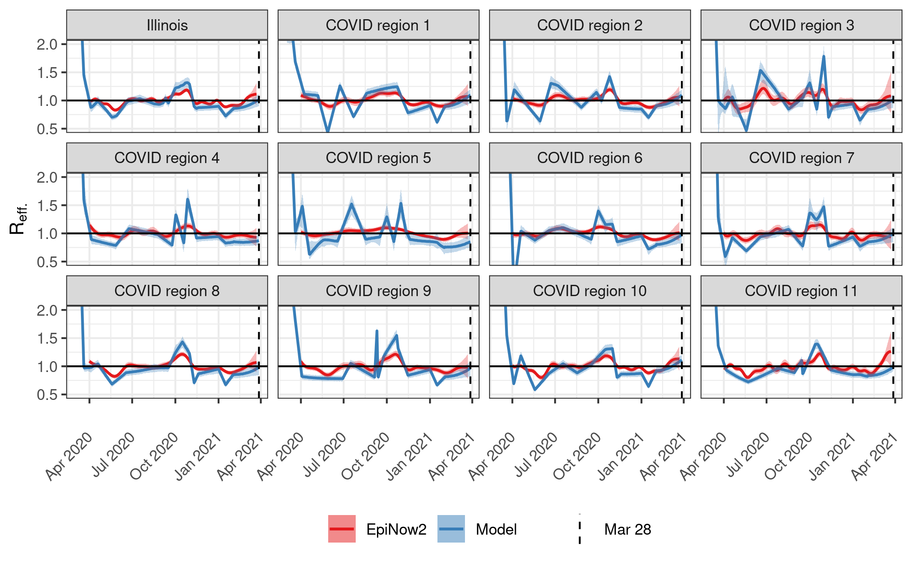

# The effective reproductive number, Reff.

## Introduction

The effective reproductive number, or Reff., measures the average number of new infections caused by each currently infectious person. Values of Reff. above one indicate that the epidemic is growing exponentially. 

## Estimating Reff.

We estimated Reff. using two different methods. First, we used the [EpiNow2](https://github.com/epiforecasts/EpiNow2) package to estimate Reff.  from daily hospital admissions with COVID-like illness (CLI). This package follows the best practices described by [Gostic et al.](https://www.medrxiv.org/content/10.1101/2020.06.18.20134858v3) Second, we estimated Reff.  using the best-fitting values for transmission rates from our dynamical model (see [Inference](../Inference) and [Forecasting](../Forecasting)).

Figure 1: Comparison of Reff. estimated from CLI with EpiNow2 (red) and Reff. inferred by our dynamical model (blue). The dashed line shows the latest date in the data used to calibrate the dynamical model. At the time of estimation, CLI data were available through January 9, 2021. 

## Changelog

### 2021-01-26
* Changed delay distribution to use data from [Faes et al.](https://www.ncbi.nlm.nih.gov/pmc/articles/PMC7589278/).